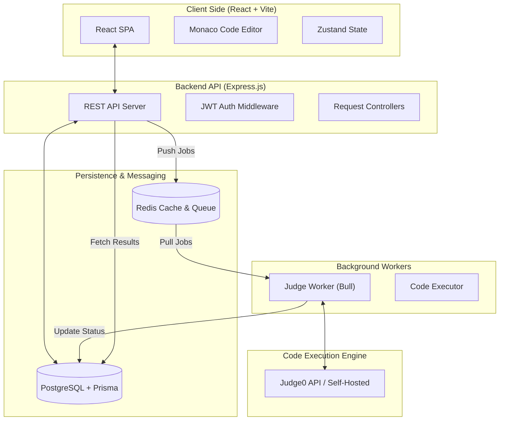
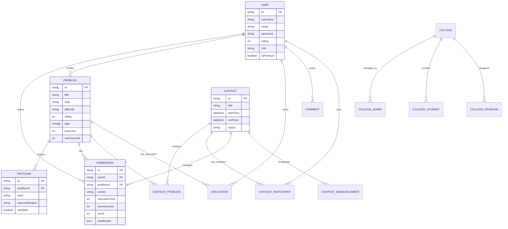
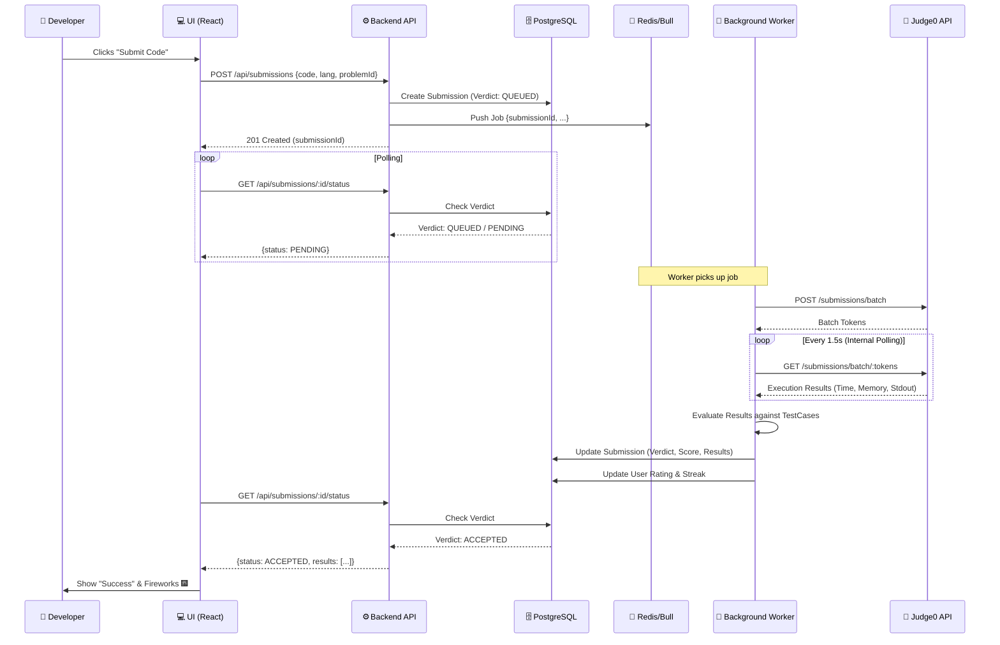
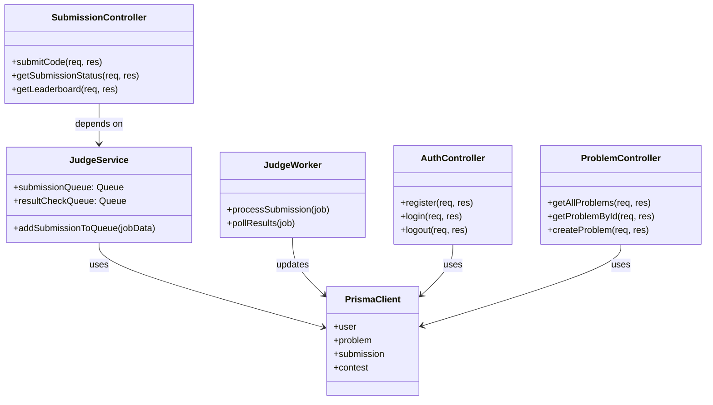

# 🏛️ MyCodingBuddy Architecture Documentation

This document provides a visual representation of the MyCodingBuddy project's architecture, data model, and core logic.

---

## 🚀 1. System & Microservice Architecture
The system uses a decoupled, event-driven architecture to handle heavy code execution tasks without blocking the main API thread.

---

## 📊 2. Entity Relationship Diagram (ERD)
The database is structured to support users, complex problem definitions, contests, and detailed submission tracking.

---

## 🔄 3. Code Submission Flow (Sequence)
Detailed flow showing the asynchronous lifecycle of a code submission.

---

## 🏗️ 4. UML Class Diagram (Backend Services)
Simplified representation of the core application logic structure.

